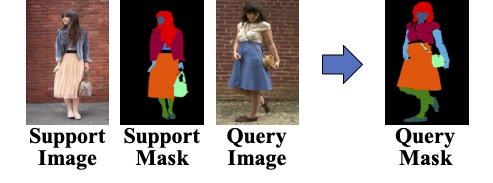

<h1 align="center">End-to-end One-shot Human Parsing</h1>

**This is the official repository for our two papers:** 

- [Progressive One-shot Human Parsing (AAAI 2021)](https://arxiv.org/abs/2012.11810)
- [End-to-end One-shot Human Parsing (journal version)](https://arxiv.org/abs/2105.01241)

***

### Introduction:

In the two papers, we propose a new task named **One-shot Human Parsing (OSHP)**. OSHP requires parsing humans in a query image into an open set of reference classes defined by any single reference example (i.e., a support image) during testing, no matter whether they have been annotated during training (base classes) or not (novel classes). This new task mainly aims to accommodate human parsing into a wider range of applications that seek to **parse flexible fashion/clothing classes** that are **not pre-defined in previous large-scale datasets**.



[Progressive One-shot Human Parsing (AAAI 2021)](https://arxiv.org/abs/2105.01241) applies a progressive training scheme and is separated into three stages.

[End-to-end One-shot Human Parsing (journal version)](https://arxiv.org/abs/2105.01241) is a one-stage end-to-end training method, which has higher performance and FPS.

***

### Main results:

You can find the well-trained models together with the performance in the following table.

| EOPNet     |                       ATR-OS, Kway F1                        | ATR-OS, Kway Fold F2 | LIP-OS, Kway F1                                              | LIP-OS, Kway F2                                              | CIHP-OS, Kway F1                                             | CIHP-OS Kway F2                                              |
| :--------- | :----------------------------------------------------------: | :------------------: | ------------------------------------------------------------ | ------------------------------------------------------------ | ------------------------------------------------------------ | ------------------------------------------------------------ |
| Novel mIoU |                             31.1                             |         34.6         | 25.7                                                         | 30.4                                                         | 20.5                                                         | 25.1                                                         |
| Human mIoU |                             61.9                             |         63.3         | 43.0                                                         | 45.7                                                         | 49.1                                                         | 45.5                                                         |
| Model      | [Model](https://drive.google.com/drive/folders/1qn-dyxmpn6F7FmPrtVl2duDPTtSUjEWF?usp=sharing) |     Coming Soon      | [Model](https://drive.google.com/drive/folders/1qn-dyxmpn6F7FmPrtVl2duDPTtSUjEWF?usp=sharing) | [Model](https://drive.google.com/drive/folders/1qn-dyxmpn6F7FmPrtVl2duDPTtSUjEWF?usp=sharing) | [Model](https://drive.google.com/drive/folders/1qn-dyxmpn6F7FmPrtVl2duDPTtSUjEWF?usp=sharing) | [Model](https://drive.google.com/drive/folders/1qn-dyxmpn6F7FmPrtVl2duDPTtSUjEWF?usp=sharing) |

You can find the well-trained models together with the performance in the following table.

|   EOPNet   | ATR-OS, 1way F1 | ATR-OS, 1way F2 | LIP-OS, 1way F1 | LIP-OS, 1way F2 | CIHP-OS, 1way F1 | CIHP-OS 1way F2 |
| :--------: | :-------------: | :-------------: | --------------- | --------------- | ---------------- | --------------- |
| Novel mIoU |      53.0       |      41.4       | 42.0            | 46.2            | 25.4             | 36.4            |
| Human mIoU |      68.2       |      69.5       | 57.0            | 58.0            | 53.8             | 55.4            |
|   Model    |   Coming Soon   |                 |                 |                 |                  |                 |

****

### Getting started:

#### Data preparation:

First, please download ATR, LIP and CIHP dataset from [source](https://drive.google.com/drive/folders/0BzvH3bSnp3E9ZW9paE9kdkJtM3M). Then, use the following commands to link the data into our project folder. Please also remember to download the

```
# ATR dataset
$ ln -s YOUR_ATR_PATH/JPEGImages/* YOUR_PROJECT_ROOT/ATR_OS/trainval_images
$ ln -s YOUR_ATR_PATH/SegmentationClassAug/* YOUR_PROJECT_ROOT/ATR_OS/trainval_classes
$ ln -s YOUR_ATR_PATH/SegmentationClassAug_rev/* YOUR_PROJECT_ROOT/ATR_OS/Category_rev_ids


# LIP dataset
$ ln -s YOUR_LIP_PATH/TrainVal_images/TrainVal_images/train_images/* YOUR_PROJECT_ROOT/LIP_OS/trainval_images
$ ln -s YOUR_LIP_PATH/TrainVal_images/TrainVal_images/val_images/* YOUR_PROJECT_ROOT/LIP_OS/trainval_images
$ ln -s YOUR_LIP_PATH/TrainVal_parsing_annotations/TrainVal_parsing_annotations/train_segmentations/* YOUR_PROJECT_ROOT/LIP_OS/trainval_classes
$ ln -s YOUR_LIP_PATH/TrainVal_parsing_annotations/TrainVal_parsing_annotations/val_segmentations/* YOUR_PROJECT_ROOT/LIP_OS/trainval_classes
$ ln -s YOUR_LIP_PATH/Train_parsing_reversed_labels/TrainVal_parsing_annotations/* YOUR_PROJECT_ROOT/LIP_OS/Category_rev_ids
$ ln -s YOUR_LIP_PATH/val_segmentations_reversed/* YOUR_PROJECT_ROOT/LIP_OS/Category_rev_ids


# CIHP dataset
$ ln -s YOUR_CIHP_PATH/Training/Images/* YOUR_PROJECT_ROOT/CIHP_OS/trainval_images
$ ln -s YOUR_CIHP_PATH/Validation/Images/* YOUR_PROJECT_ROOT/CIHP_OS/trainval_images
$ ln -s YOUR_CIHP_PATH/Training/Category_ids/* YOUR_PROJECT_ROOT/CIHP_OS/trainval_classes
$ ln -s YOUR_CIHP_PATH/Validation/Category_ids/* YOUR_PROJECT_ROOT/CIHP_OS/trainval_classes
$ ln -s YOUR_CIHP_PATH/Category_rev_ids/* YOUR_PROJECT_ROOT/CIHP_OS/Category_rev_ids

```

Please also download our generated support .pkl files from [source](https://drive.google.com/drive/folders/16o31vdARktW5jxLwKvPcVfaypzzy5Fdl?usp=sharing), which contains each class's image IDs. You can also generate support files on your own by controlling ```dtrain_dtest_split``` in ```oshp_loader.py```, however, the training and validation list might be different from our paper.

Finally, your data folder should look like this:

```
${PROJECT ROOT}
|-- data
|   |--datasets
|       |-- ATR_OS
|       |   |-- list
|       |   |   |-- meta_train_id.txt
|       |   |   `-- meta_test_id.txt
|       |   |-- support
|       |   |   |-- meta_train_atr_supports.pkl
|       |   |   `-- meta_test_atr_supports.pkl
|       |   |-- trainval_images
|       |   |   |-- 997-1.jpg
|       |   |   |-- 997-2.jpg
|       |   |   `-- ...
|       |   |-- trainval_classes
|       |   |   |-- 997-1.png
|       |   |   |-- 997-2.png
|       |   |   `-- ... 
|       |   `-- Category_rev_ids
|       |       |-- 997-1.png
|       |       |-- 997-2.png
|       |       `-- ... 
|       |-- LIP_OS
|       |   |-- list
|       |   |   |-- meta_train_id.txt
|       |   |   |-- meta_test_id.txt
|       |   |-- support
|       |   |   |-- meta_train_lip_supports.pkl
|       |   |   `-- meta_test_lip_supports.pkl
|       |   |-- trainval_images
|       |   |   |-- ...
|       |   |-- trainval_classes
|       |   |   |-- ... 
|       |   `-- Category_rev_ids
|       |       |-- ... 
|       `-- CIHP_OS
|           |-- list
|           |   |-- meta_train_id.txt
|           |   |-- meta_test_id.txt
|           |-- support
|           |   |-- meta_train_cihp_supports.pkl
|           |   `-- meta_test_cihp_supports.pkl
|           |-- trainval_images
|           |   |-- ...
|           |-- trainval_classes
|           |   |-- ... 
|           `-- Category_rev_ids
|               |-- ... 
```

Finally, please download the DeepLab V3+ pretrained model (pretrained on COCO dataset) from [source](https://drive.google.com/drive/folders/16o31vdARktW5jxLwKvPcVfaypzzy5Fdl?usp=sharing) and put it into the data folder:

```
${PROJECT ROOT}
|-- data
|   |--pretrained_model
|       |--deeplab_v3plus_v3.pth
```


#### Installation:

Please make sure your current environment has  `Python >= 3.7.0 ` and  `pytorch >= 1.1.0`. The pytorch can be downloaded from [source](https://pytorch.org/get-started/previous-versions/).

Then, clone the repository and install the dependencies from the following commands:

```git clone
git clone https://github.com/Charleshhy/One-shot-Human-Parsing.git
cd One-shot-Human-Parsing
pip install -r requirements.txt
```


#### Training:

To train our model, run:

```  bash scripts/atr
# OSHP kway on ATR-OS fold 1
bash scripts/atr_eop_kwf1.sh
```


#### Validation:

To evaluate our model, run:

```  bash scripts/atr
# OSHP kway on ATR-OS fold 1
bash scripts/evaluate_atr_eop_kwf1.sh
```


#### Citation:

If you find our papers or this repository useful, please consider cite our papers:

```
@inproceedings{he2021progressive,
title={Progressive One-shot Human Parsing},
author={He, Haoyu and Zhang, Jing and Thuraisingham, Bhavani and Tao, Dacheng},
booktitle={Proceedings of the AAAI Conference on Artificial Intelligence},
year={2021}
}

@article{he2021end,
title={End-to-end One-shot Human Parsing},
author={He, Haoyu and Zhang, Jing and Zhuang, Bohan and Cai, Jianfei and Tao, Dacheng},
journal={arXiv preprint arXiv:2105.01241},
year={2021}
}
```

